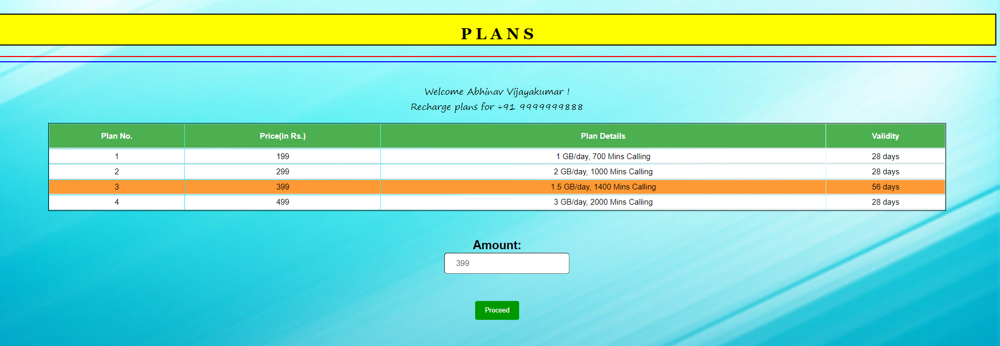

#  Quick Recharge - Online-Recharge-System

Hey! I have developed an Online Recharge System module which consists of the following pages:
<ul>
<li>Index/Home Page</li>
<li>Customer Info Form Page</li>
<li>View and Select Recharge Plans Page</li>
<li>End Page</li>
</ul>

In this project, the user firstly visits the home page and selects from various options like Recharge etc.  
  
On clicking recharge, the user is directed to a form page in which they have to give their details and about the Telecom operator. 
In this form, I have applied Inline Validation over various fields such as First and Last Name, Country Code, Mobile Number etc. 
  
  
  
  

After entering the details correctly, the user is directed to the View and Select Recharge Plans Page where they can view the plans avaialable for the given mobile number and thus get their recharge done.
 
 
 After choosing the plan, the user has to enter the plan amount in the input box given, after which they are directed to the EndPage. 
If the correct amount is entered, then a 'Success' message is displayed. Else a messsage to enter a valid amount is displayed and the user has to repeat the process.  
 
  

 
  

